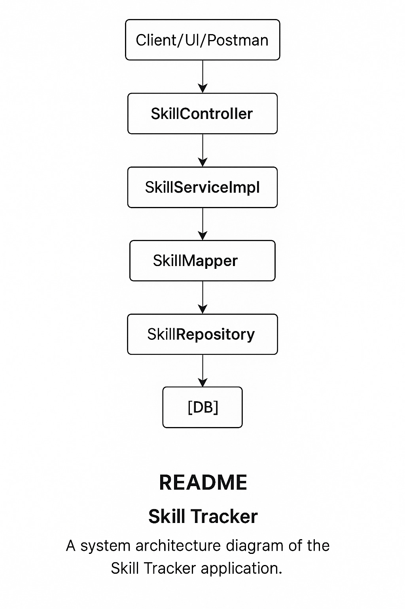

# 📘 Skill Tracker – Spring Boot Project

A **Skill Tracker** application built using Spring Boot that allows users to manage technical or personal skills. The project follows a layered architecture (Controller → Service → Repository) and uses DTOs, mappers, and custom exception handling. This is ideal for learning **Spring Boot, REST APIs, layered architecture, DTO mapping, and basic system design**.

---

## 📌 Features

- Add, update, retrieve, and delete skills
- Search skills by category
- Exception handling for common errors
- DTO-Entity mapping via Mapper layer
- Structured using clean architecture principles

---

## 🛠️ Tech Stack

| Layer        | Technology     |
|--------------|----------------|
| Language     | Java 17+       |
| Framework    | Spring Boot 3  |
| Data Layer   | Spring Data JPA|
| Database     | MySQL/PostgreSQL|
| Build Tool   | Maven          |
| Dev Tool     | IntelliJ IDEA  |
| Testing Tool | Postman        |

---

## 🏗️ System Design (Layered Architecture)

1. **Client Layer**: Postman/UI sends HTTP requests.
2. **Controller Layer**: Handles incoming requests.
3. **Service Layer**: Contains business logic.
4. **Mapper Layer**: Maps between Entity and DTO.
5. **Repository Layer**: Interacts with the database using JPA.
6. **Database Layer**: Stores skill records.



---

## 📂 Project Structure

```
skilltracker/
├── controller/
│   └── SkillController.java
├── dto/
│   └── SkillDTO.java
├── exception/
│   ├── ResourceNotFoundException.java
│   └── GlobalExceptionHandler.java
├── mapper/
│   └── SkillMapper.java
├── model/
│   └── Skill.java
├── repository/
│   └── SkillRepository.java
├── service/
│   ├── SkillService.java
│   └── SkillServiceImpl.java
└── SkilltrackerApplication.java
```

---

[//]: # (## 🚀 Running the Application)

[//]: # ()
[//]: # (### Prerequisites)

[//]: # (- Java 17+)

[//]: # (- Maven)

[//]: # (- MySQL or PostgreSQL)

[//]: # ()
[//]: # (### Steps)

[//]: # (```bash)

[//]: # (# Clone repo)

[//]: # (git clone https://github.com/your-username/skilltracker.git)

[//]: # ()
[//]: # (# Navigate)

[//]: # (cd skilltracker)

[//]: # ()
[//]: # (# Set up database &#40;example: MySQL&#41;)

[//]: # (# CREATE DATABASE skill_tracker;)

[//]: # ()
[//]: # (# Update `application.properties` with DB details)

[//]: # ()
[//]: # (# Run app)

[//]: # (mvn spring-boot:run)

[//]: # (```)

[//]: # ()
[//]: # (---)

## 📬 API Endpoints

| Method | Endpoint                             | Description        |
|--------|--------------------------------------|--------------------|
| POST   | `/api/v1/skills`                     | Create a new skill |
| GET    | `/api/v1/skills/{id}`                | Get skill by ID    |
| GET    | `/api/v1/skills`                     | Get all skills     |
| PUT    | `/api/v1/skills/{id}`                | Update a skill     |
| DELETE | `/api/v1/skills/{id}`                | Delete a skill     |
| GET    | `/api/v1/skills/category/{category}` | Filter by category |

---

## ✅ Learning Outcomes

- Understand full-stack flow in Spring Boot
- Learn DTO and Entity mapping
- Practice Exception handling
- Structure a professional Java backend project
